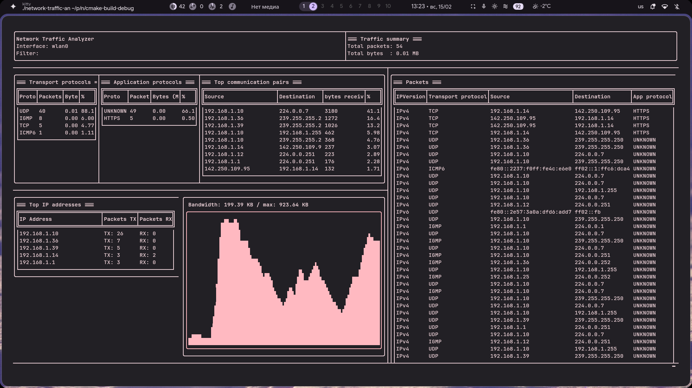

```ruby
▄▄▄▄▄▄ ▄▄▄▄   ▄▄▄  ▄▄▄▄▄ ▄▄▄▄▄ ▄▄  ▄▄▄▄    ▄▄▄  ▄▄  ▄▄  ▄▄▄  ▄▄  ▄▄ ▄▄ ▄▄▄▄▄ ▄▄▄▄▄ ▄▄▄▄
  ██   ██▄█▄ ██▀██ ██▄▄  ██▄▄  ██ ██▀▀▀   ██▀██ ███▄██ ██▀██ ██  ▀███▀   ▄█▀ ██▄▄  ██▄█▄
  ██   ██ ██ ██▀██ ██    ██    ██ ▀████   ██▀██ ██ ▀██ ██▀██ ██▄▄▄ █   ▄██▄▄ ██▄▄▄ ██ ██

```

>A high-performance CLI network analyzer built with libpcap for raw packet capture and FTXUI for a fully interactive terminal UI.
The application captures packets directly from a network interface, parses protocol headers manually, aggregates statistics in real time

*Developed by [@deniskhud](https://github.com/deniskhud)*

---


> [!IMPORTANT]
> Packet capture requires elevated privileges.

Run with:

```bash
sudo ./network-traffic-analyzer
```

Or grant capabilities:

```bash
sudo setcap cap_net_raw,cap_net_admin=eip ./network-traffic-analyzer
```

Or you can use `just` command
```
just run
 ```
---

# Features
1) ## Live Packet Capture
- Capture traffic from a selected network interface
- Support for BPF filters (e.g. tcp, port 80, udp)
- Real-time processing using libpcap

2) ## Real-Time Statistics Engine
- Total packets & traffic volume
- Transport protocol distribution (TCP / UDP / ICMP)
- Application-level classification (port-based)
- Top IP addresses
- Top source > destination pairs

3) ## Flexible Capture Modes
- Live capture from selected network interface (-i, --interface)
- Offline analysis from .pcap file (-r, --offline)
- Packet count limit (-c)
- Time limit for capture (-t)
- Interface discovery (--interfaces)

> [!TIP]
> For the complete list of CLI options, use:
> `--help`

# Technologies
- C++20+
- Boost::program_options
- libpcap
- FTXUI
- CMake

# Setup
## 1. clone the repo then
```bash
cd network-traffic-analyzer
./install.sh
```

# Usage Example

### Live capture on eth0
```
just capture -i eth0
```
### Capture 100 packets
```
just run -i wlan0 -c 100
```
### Analyze offline pcap file
```
just run --offline traffic.pcap
```
### Export results (json / csv)
```
just run --json result.json --csv result.csv
```

---

## Learn More

| Doc | Contents |
|-----|----------|
| [00-OVERVIEW.md](./learn/00-OVERVIEW.md) | Quick start, prerequisites, project structure |
| [01-CONCEPTS.md](./learn/01-CONCEPTS.md) | libpcap internals, BPF filters, protocol header parsing |
| [02-ARCHITECTURE.md](./learn/02-ARCHITECTURE.md) | System design, component breakdown, data flow, threading model |
| [03-IMPLEMENTATION.md](./learn/03-IMPLEMENTATION.md) | Line-by-line code walkthrough |
| [04-CHALLENGES.md](./learn/04-CHALLENGES.md) | Extension ideas and advanced topics |
